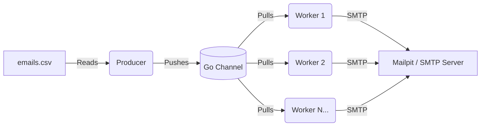

# Email Campaign Tool (Golang)

A highly concurrent, lightweight email dispatcher tool built with Go. It leverages the Producer-Consumer pattern and goroutines to efficiently read recipient data from a CSV file and dispatch emails using a worker pool.

## 🚀 Project Flow

The system architecture is designed around concurrent processing to maximize throughput:

1. **Producer (`producer.go`)**: Reads recipient details (Name, Email) from `emails.csv` and pushes them onto a shared Go channel.
2. **Channel**: Acts as a thread-safe queue holding the recipient data, decoupling the reading process from the sending process.
3. **Consumer Pool (`consumer.go`)**: A pool of worker goroutines (5 by default) listens to the channel. As soon as data arrives, a worker picks it up.
4. **Template Engine (`main.go`)**: Before sending, the worker parses an HTML template (`email.tmpl`) to generate a personalized email body.
5. **SMTP Dispatch**: The worker sends the email via a local SMTP server (e.g., Mailpit for testing).



## 📸 Screenshots

Here is a look at the system in action:


## 🛠️ Prerequisites

- **Go**: Ensure Go is installed on your machine.
- **Docker**: Used to run `mailpit`, a local email testing tool.

## ⚙️ Getting Started

### 1. Start the Mailpit SMTP Server

Run the following Docker command to start Mailpit locally. It will expose port `1025` for SMTP and `8025` for the web UI.

```bash
docker run -d \
  --restart unless-stopped \
  --name=mailpit \
  -p 8025:8025 \
  -p 1025:1025 \
  axllent/mailpit
```

You can view the intercepted emails by visiting `http://localhost:8025` in your browser.

### 2. Configure Recipients and Template

- Edit `emails.csv` to add your list of recipients (format: `Name,Email`).
- Edit `email.tmpl` to customize your HTML email template.

### 3. Run the Dispatcher

Execute the Go application to start processing and sending emails:

```bash
go run .
```
